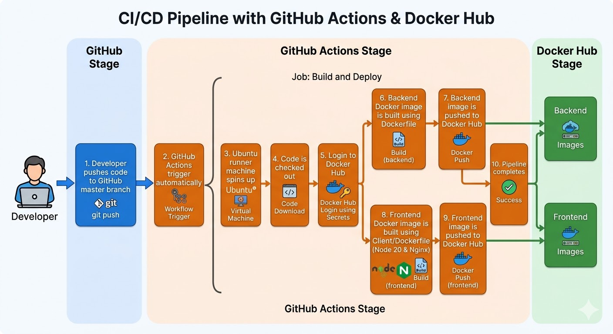

# Expo Management Center

A full-stack Event Expo Management System with automated CI/CD pipeline using GitHub Actions and Docker.

---

## Tech Stack

- **Frontend:** React + TypeScript + Vite + TailwindCSS
- **Backend:** Node.js + Express.js + MongoDB
- **DevOps:** Docker, Docker Compose, GitHub Actions

---

## CI/CD Pipeline

Every push to `master` automatically:
1. Triggers GitHub Actions
2. Builds backend Docker image
3. Builds frontend Docker image
4. Pushes both images to Docker Hub



---

## Docker Images

| Service | Image |
|---|---|
| Backend | `farhan249/expo-backend:latest` |
| Frontend | `farhan249/expo-frontend:latest` |

🐳 [View on Docker Hub](https://hub.docker.com/u/farhan249)

---

## Run Locally

Make sure Docker and Docker Compose are installed.
```bash
docker pull farhan249/expo-backend:latest
docker pull farhan249/expo-frontend:latest
docker compose up
```

App will be live at **http://localhost:80**

---

## Project Structure
```
├── Client/          # React frontend
├── Server/          # Node.js backend
├── Dockerfile       # Backend container
├── Client/Dockerfile # Frontend container
├── docker-compose.yml
└── .github/workflows/deploy.yaml
```
